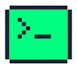

#  Terminix 
A terminal emulator for Linux and high POSIX-compatible operating systems. Written in QtQuick/QML 6.7 and C++.
Using a custom minimal shell: [nutshell](https://github.com/lanphgphm/nutshell) 

## Features
- `Ctrl+M` to toggle maximizing window 
- Muted dark theme with high contrast fonts and basic output coloring 

## Developer setup 
### Requirements: 
- Qt 6.7.1
- CMake 3.29.3
- GCC 14.1.1
    
### Recommended:
- Visual Studio Code

### Build instructions: 
1. Clone the repository && `cd` into it
```bash 
git clone https://github.com/lanphgphm/terminix.git
cd terminix 
```

2. Compile source code & run app
On Linux:
```bash 
mkdir -p build 
cd build
cmake .. && cmake --build . && ./appterminix
```
## User installation 
This product is not ready to be shipped to end-users. Please refer to the developer setup section for building and running the application.